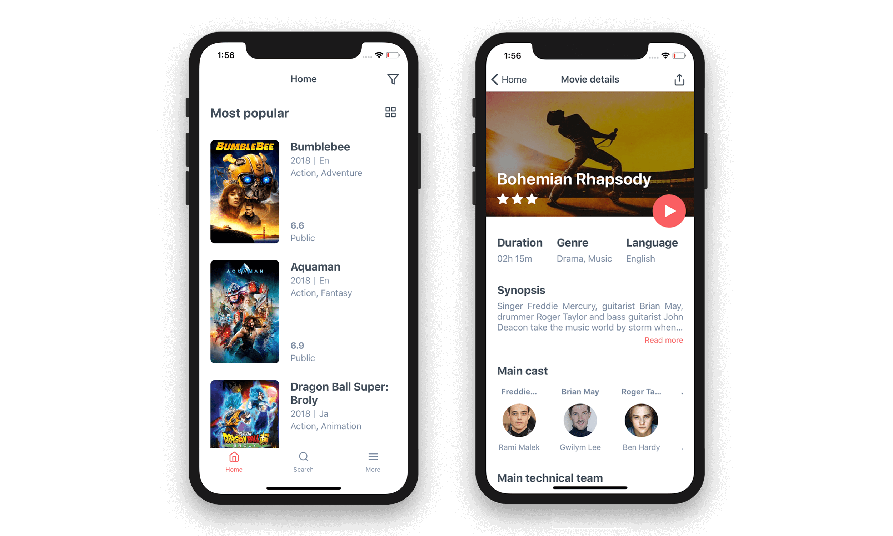

  
  <h3 align="center">Cine: The Movie Guide</h3>

---

Cine is your movie guide. The fastest and easiest way to find Movies, Actors and Series on your device. Know about ratings and reviews from The Movie Database (TMDb).

## APIs

- [TMDb](https://developers.themoviedb.org/3/getting-started/introduction)

## Dribbble

https://dribbble.com/shots/5409613-Cinema-App-UI

## Expo

This project has been built using Expo. The choice of the expo was for quick prototyping of the project, in the future maybe it will be removed.

Go to expo project page:

https://expo.io/@murillo94/cine-the-movie-guide

or

Scan the below QR code to open the project on Android:

## Contributing

Any bug reports, feature requests and other contributions are more than welcome!  
Whenever possible, please make a pull request with the implementation instead of just requesting it.

If the feature is big, open an issue first for discussion.

### Running it locally

#### Requirements

- [Node.js](https://nodejs.org/) (latest)
- [Expo](https://expo.io/) (latest)
- [Yarn](https://yarnpkg.com/)

#### How to run

- `git clone git@github.com:murillo94/cine-the-guide-movie.git`
- `yarn install`

To open the project, choose one:

- `yarn ios`
- `yarn android`
- `yarn start`

## License

AGPL-3.0, see the [LICENSE](./LICENSE.md) file.
